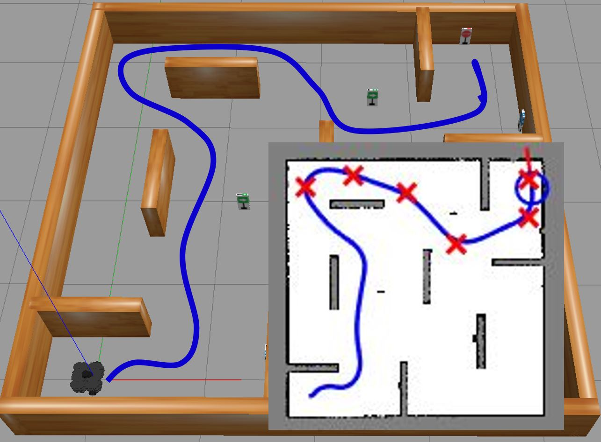

# Autonomous Navigation for Mobile Robots and UGV
<!-- This is the "Title of the contribution" that was approved during the Community Contribution Review Process --> 

 
<!-- Add this icon to the README if this repo also appears on File Exchange via the "Connect to GitHub" feature --> 

This GitHub&reg; repository contains MATLAB&reg; and Simulink&reg; examples for developing autonomous navigation software stacks for mobile robots and unmanned ground vehicles (UGV). The examples contained in this submission demonstrate how to interact with ROS-enabled robots and equivalent simulations to design and test a software stack for autonomous navigation of a Turtlebot3.

Topics covered in this collection of scripts and models include:
## Creating Maps for Autonomous Navigation
* Create Maps from Numerical Arrays
* Create Maps from Images
* Control ROS-Based Robots to Acquire Lidar Scans
* Import and Plot ROS Data from a rosbag
* Integrate rosbag Recordings Into Simulations
* Create Maps From Lidar Scans using SLAM
## Motion Planning and Path Following
* Simulate Waypoint Following Controller Using Pure Pursuit
* Command ROS Robot to Follow Waypoints Using Pure Pursuit
* Generate Path Between Two Locations Using a PRM Planner
* Simulate Path Planning and Following
* Test Path Planner + Follower in ROS Robot 
* Simulate Obstacle Avoidance Using VFH Controller
* Test Obstacle Avoidance on ROS Robot
* Simulate Complete Path Navigation Stack
* Test Complete Path Navigation Stack in ROS Robot
* Simulate Path Re-Planning Scheduler Using Stateflow&reg;
* Test Re-Planning Scheduler in ROS Robot
## Trajectory Generation
* Interpolate Smooth Paths from Critical Navigation Waypoints
* Simulate Smooth Path Navigation
* Navigate Environment Using a Polynomial Trajectory
* Navigate Environment Using a Trapezoidal Velocity Trajectory
## Localization and SLAM
* Design and test SLAM in Robots powered by ROS
* Generate Custom SLAM ROS Nodes

To learn more about the MATLAB/Simulink toolboxes used in this submission, visit the following documentation pages:

- [Robotics System Toolbox&trade;](https://www.mathworks.com/help/robotics/examples.html)
- [Navigation Toolbox&trade;](https://www.mathworks.com/help/nav/examples.html)
- [ROS Toolbox](https://www.mathworks.com/help/ros/examples.html)

